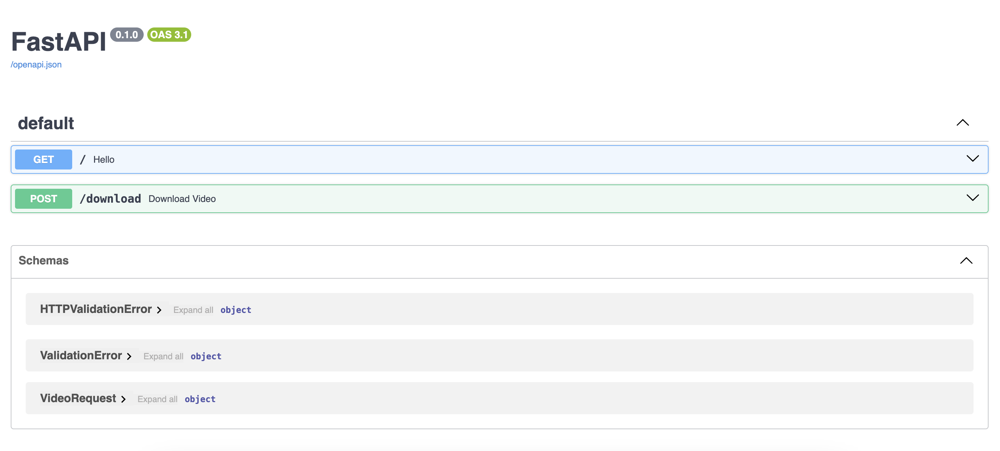

# API Youtube Downloader

[](LICENSE)

Youtube Downloader API using FastAPI which provides a simple and powerful interface to download youtube videos.  

## Description  

My API provides the ability to freely download youtube videos by providing only the youtube page URL. It works in conjunction with a Chrome extension, which allows users to download any youtube video with a single click.  



## Table of Contents

- [Getting Started](#Getting-Started)
- [Launch Application](#Launch-Application)
- [Contributing](#Contributing)
- [License](#License)  

## Getting Started  

```bash
git clone https://github.com/HaDock404/api-youtube-downloader.git
cd api-youtube-downloader
pip install -r ./packages/requirements.txt
``` 
or you can create a container 

```bash
git clone https://github.com/HaDock404/api-youtube-downloader.git
cd api-youtube-downloader
docker build -t your_name/dockerimg:v0 .
sudo docker run -dp 8081:8000 -ti --name Container your_name/dockerimg:v0
``` 

## Launch Application   

```bash
uvicorn api:app -—reload
```  

## Contributing

Pull requests are welcome. For major changes, please open an issue first
to discuss what you would like to change.

Please make sure to update tests as appropriate.

## License  

This project is licensed under the MIT License - see the [LICENSE](./LICENSE) file for details.